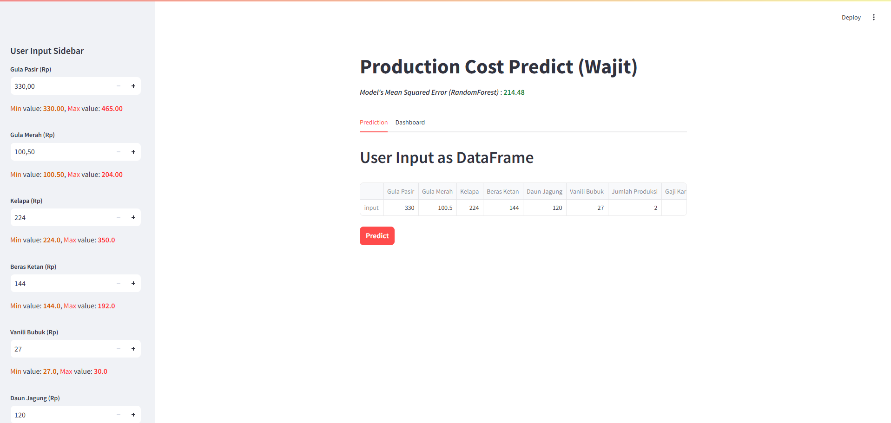

# Optimasi Produksi UMKM melalui Penerapan Analisi Data

Tugas Capstone Project Dicoding Data Science

Kelompok : `DB4-PS007`

- Link aplikasi : https://cp-predict-cost-wajit-dashboard-db4-ps007.streamlit.app/

## Pembahasan

Repositori ini berfokus pada prediksi biaya harga produksi wajit. Proyek ini menggunakan <strong>Streamlit</strong> untuk visualisasi data dan dapat ditemukan <a href="https://drive.google.com/file/d/1Tu9uOavkcdYZc8wrPhQjoRBrrMSiDqYtYh0lcqHSXRg/view">di sini</a>. 

Proyek ini memungkinkan pengguna untuk mengeksplorasi prediksi biaya harga produksi wajit berdasarkan 9 atribut utama:

<ul>
    <li>Gula Pasir (Rp)</li>
    <li>Gula Merah (Rp)</li>
    <li>Kelapa (Rp)</li>
    <li>Beras Ketan (Rp)</li>
    <li>Vanili Bubuk (Rp)</li>
    <li>Daun Jagung (Rp)</li>
    <li>Jumlah Produksi (Rp)</li>
    <li>Gaji Karyawan (Rp)</li>
    <li>Biaya Overhead (Listrik, Gas, Plastik, dll.)</li>
</ul>

##Tampilan Aplikasi Wajit Kira

